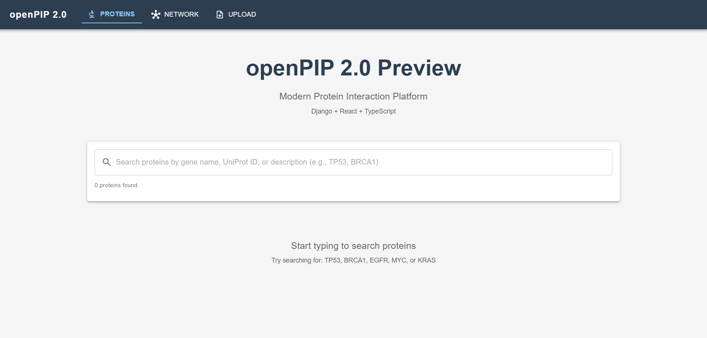
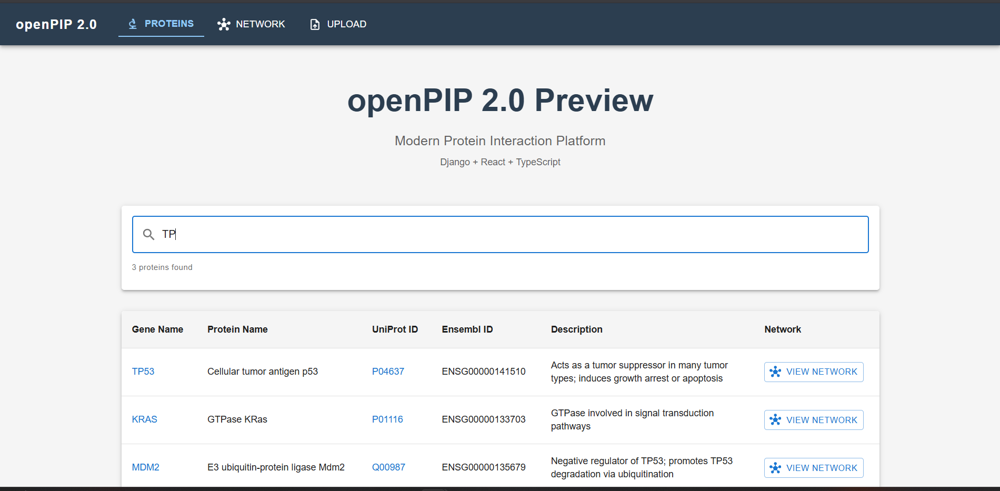
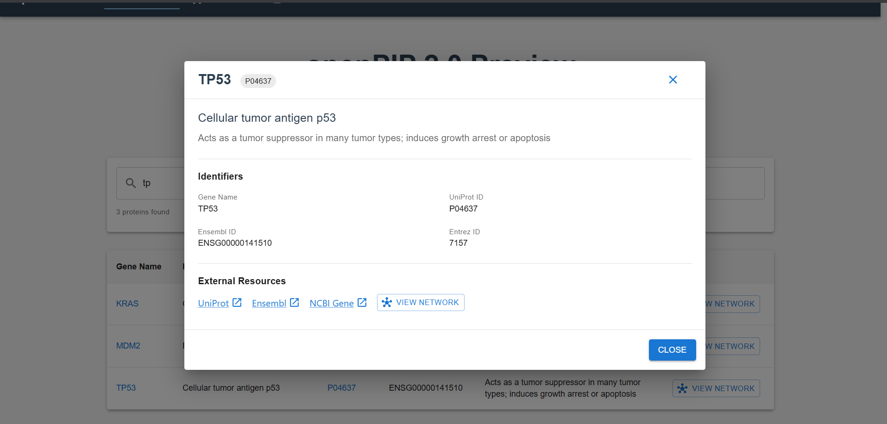
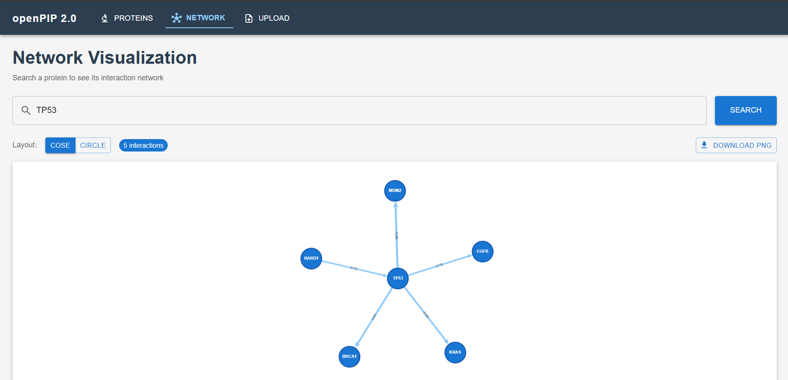
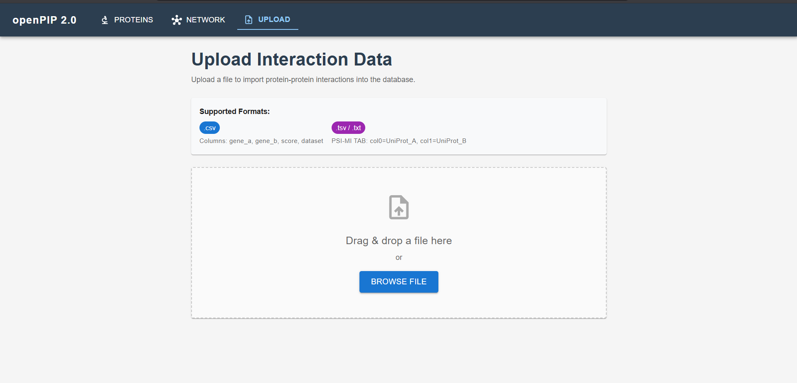

# openPIP 2.0

**A Modern Protein Interaction Platform**

> A complete rewrite of openPIP using Django, React, and Docker — bringing a modern tech stack to protein interaction data management.

[](https://www.djangoproject.com/)
[](https://reactjs.org/)
[](https://www.typescriptlang.org/)
[](https://mui.com/)

---

## 🎯 What This Is

openPIP 2.0 is a modern, open-source platform for exploring and managing protein-protein interaction (PPI) data. It replaces an aging PHP/Symfony stack with a clean Django REST backend and a React/TypeScript frontend, making the system easier to maintain, extend, and deploy.

The original openPIP served thousands of proteins and interactions but was built on technologies that have been end-of-life since 2019. This rewrite modernizes the entire stack while preserving and improving the core functionality.

**What works in this version:**
- Django REST API with protein search and PPI filtering
- PSI-MI TAB and CSV file upload with row-by-row validation
- Cytoscape.js network visualization with layout switching
- Docker Compose one-command deployment

**Planned additions:**
- Organism-agnostic data model (JSONB metadata, cross-species interaction support)
- Three search modes (network, between, direct)
- Full PSI-MI TAB 2.7 + 2.8 + CSV parser pipeline
- Admin feature toggle system
- REST API with OpenAPI documentation
- PostgreSQL with pg_trgm fuzzy search


---

## 🚀 Features

### Backend (Django)
- **Protein Data Model**: Gene names, UniProt IDs, Ensembl IDs, Entrez IDs, descriptions, sequences
- **Interaction Model**: Protein-protein interactions with score, type (physical/genetic/regulatory), and dataset
- **REST API**: Full CRUD for proteins, read-only interactions API with `?protein=` filter
- **File Upload API**: `POST /api/upload/` - parses CSV and PSI-MI TAB (TSV) files via pandas
- **Search Functionality**: Multi-field search across protein attributes
- **Admin Panel**: Django admin for proteins and interactions
- **CORS Enabled**: Ready for frontend integration

### Frontend (React)
- **Real-time Search**: Instant protein search as you type
- **Interactive Detail View**: Click any protein row to see full details in a modal
- **External Links**: Direct links to UniProt, Ensembl, and NCBI databases
- **Network Visualization**: Cytoscape.js interactive graph - search a protein to see its PPI network
- **Layout Toggle**: Switch between CoSE and Circle graph layouts
- **File Upload**: Drag-and-drop CSV/TSV upload with row-by-row validation and error reporting
- **Export PNG**: Download the network graph as a high-resolution PNG image
- **Navigation**: Multi-page app with Proteins | Network | Upload nav bar
- **TypeScript**: Full type safety for better code quality
- **Error Handling**: Graceful error states and loading indicators

---

## 📸 Screenshots

### Search Interface







---

## 🛠️ Tech Stack

### Tech Stack

| Layer | Technology |
|-------|------------|
| Backend | Django 6.0.2 + Django REST Framework 3.16 |
| Frontend | React 18 + TypeScript 5.9 + Vite 7.3 |
| UI | Material-UI 7.3 |
| Graph | Cytoscape.js 3.33 |
| Upload | react-dropzone + pandas |
| Routing | react-router-dom |
| Database | SQLite (upgradable to PostgreSQL) |
| DevOps | Docker + nginx |


## 🏃 Quick Start

### 🐳 Docker (Recommended - One Command!)

**Prerequisites:**
- Docker Desktop installed and running

```bash
# Clone the repository
git clone https://github.com/Slambot01/openPIp-prev.git
cd openPIp-prev

# Start everything with one command
docker-compose up --build

# Access the application:
# - Frontend: http://localhost:3000
# - Backend API: http://localhost:8000/api/proteins/
```

That's it! Docker will automatically:
- Build backend and frontend containers
- Run database migrations
- Load sample protein data
- Start both servers

To stop: `Ctrl+C` and then `docker-compose down`

---

### 💻 Manual Setup (Without Docker)

### Prerequisites
- Python 3.13+
- Node.js 18+
- npm or yarn

### Backend Setup

```bash
# Navigate to backend directory
cd backend

# Create virtual environment
python -m venv venv

# Activate virtual environment (Windows)
.\venv\Scripts\Activate
# On Mac/Linux: source venv/bin/activate

# Install dependencies
pip install -r requirements.txt

# Run migrations
python manage.py migrate

# Load sample data
python manage.py load_sample_proteins

# Start Django server
python manage.py runserver
```

Backend will be running at: **http://127.0.0.1:8000**

API endpoint: **http://127.0.0.1:8000/api/proteins/**

### Frontend Setup

```bash
# Navigate to frontend directory
cd frontend

# Install dependencies
npm install

# Start development server
npm run dev
```

Frontend will be running at: **http://localhost:5173**

---

## 📡 API Endpoints

| Method | Endpoint | Description |
|--------|----------|-------------|
| GET | `/api/proteins/` | List all proteins |
| GET | `/api/proteins/?search=TP53` | Search proteins |
| GET | `/api/proteins/{id}/` | Get single protein |
| GET | `/api/interactions/` | List all interactions |
| GET | `/api/interactions/?protein=TP53` | Get interactions for a protein |
| POST | `/api/upload/` | Upload CSV/TSV file of interactions |

### Example: Get TP53 interactions
```bash
curl http://127.0.0.1:8000/api/interactions/?protein=TP53
```
```json
{
  "results": [
    {
      "id": 1,
      "protein_a": { "gene_name": "TP53", "uniprot_id": "P04637" },
      "protein_b": { "gene_name": "MDM2", "uniprot_id": "Q00987" },
      "score": 0.99,
      "interaction_type": "physical",
      "dataset": "STRING"
    }
  ]
}
```

---

## 📂 Project Structure

```
openpip-2.0-preview/
├── backend/
│   ├── openpip/              # Django project settings
│   ├── proteins/             # Proteins Django app
│   │   ├── models.py         # Protein + Interaction models
│   │   ├── serializers.py    # DRF serializers (nested)
│   │   ├── views.py          # API views + UploadView
│   │   ├── urls.py           # URL routing
│   │   └── management/       # load_sample_proteins command
│   ├── manage.py
│   └── requirements.txt
│
└── frontend/
    ├── src/
    │   ├── api/              # proteinApi.ts (typed API client)
    │   ├── pages/
    │   │   ├── NetworkPage.tsx  # Cytoscape.js visualization
    │   │   └── UploadPage.tsx   # Drag-and-drop upload
    │   ├── App.tsx           # Nav bar + routing
    │   └── main.tsx          # Entry point
    ├── package.json
    └── vite.config.ts
```

---

## ✅ What's Implemented

Key technical notes from building this:

1. **Cytoscape.js inside React** requires stable callback refs with `useRef` to prevent stale closures — the container div ref must be stable across renders or the graph initializes on a detached DOM node.

2. **PSI-MI TAB parsing** is more complex than it looks — column 5 (interaction detection method) uses PSI-MI controlled vocabulary terms like `psi-mi:"MI:0018"(two hybrid)` that need to be parsed and normalized separately from the display name.

3. **Docker on Windows** has file-watching and volume mount issues with Vite's dev server — solved by setting `CHOKIDAR_USEPOLLING=true` in the frontend container environment.

### Completed Features

**Backend:**
- Django + Django REST Framework setup
- Protein + Interaction data models  
- RESTful API with search and interaction filtering
- File upload endpoint (CSV + PSI-MI TAB via pandas)
- Row-by-row validation with error reporting
- Django admin for proteins and interactions
- Sample data: 7 proteins + 10 real PPI pairs
- Docker containerization with automated migrations

**Frontend:**
- React 18 + TypeScript + Vite + Material-UI
- Real-time protein search with instant results
- Protein detail modal with external links (UniProt, Ensembl, NCBI)
- Cytoscape.js network visualization (/network page)
- CoSE and Circle layout toggle
- Drag-and-drop file upload with validation (/upload page)
- PNG network export
- Multi-page navigation (Proteins | Network | Upload)
- Docker + Nginx production setup

**DevOps:**
- Docker Compose one-command deployment
- Automated migrations + data seeding on startup

---

### 🚧 Planned Features

**Data Model (Major Redesign):**
- Organism-agnostic data model - separate Organism, Molecule, and MoleculeIdentifier tables
- PostgreSQL with JSONB metadata fields for organism-specific data (tissue expression for human, localization for yeast, strain info for viral proteins)
- Cross-species interaction support with is_cross_species auto-computed flag
- MoleculeIdentifier table for cross-reference resolution (same protein appearing as "P04637" or "TP53" resolves to one record)

**Search (Major Enhancement):**
- Three distinct search modes:
  * Network mode: query proteins + all interactors + interactions among interactors
  * Between mode: only interactions between query proteins
  * Direct mode: only direct interactions with query proteins
- pg_trgm fuzzy autocomplete across gene symbols, UniProt IDs, Ensembl IDs simultaneously
- MAX_RESULTS safety limit to prevent browser crashes on hub proteins like TP53

**Parser Pipeline (New):**
- PSI-MI TAB 2.7 full parser with column mapping
- PSI-MI TAB 2.8 parser (42-column spec)
- CSV parser with interactive column assignment UI
- Unified validation framework with per-row error reports
- Async processing with Celery for large files (HuRI has 77,000+ interactions)

**API (Major Enhancement):**
- Full REST API with OpenAPI/Swagger auto-documentation
- PSICQUIC-compatible query interface
- Content negotiation (JSON, PSI-MI TAB, CSV responses)
- JWT authentication for protected endpoints
- Rate limiting and pagination

**Admin Panel (New):**
- Feature toggle system - on/off switches for:
  * Tissue expression filter
  * Each external tool link individually  
  * Confidence score display
  * Cross-species interaction mode
  * API access
- Drag-and-drop dataset upload with real-time validation
- Rich text content management (About, FAQ, Contact pages)
- News and announcements management
- Branding customization (colors, titles, logo)

**Visualization (Enhancement):**
- Host-pathogen coloring - host proteins in blue, pathogen proteins in red, cross-species edges dashed
- Confidence-weighted edges (thickness + opacity)
- All 5 Cytoscape.js layouts from original openPIP (CoLa, CoSE, concentric, circle, grid)
- Node popup: protein function, UniProt/Ensembl IDs, sequence link
- Edge popup: interaction details, detection method, publication, experimental configuration

**Integration:**
- UniProt + Ensembl API auto-annotation on upload
- External tool links: STRING, GeneMANIA, Reactome, Pathway Commons, DAVID, g:Profiler, cBioPortal, Complex Portal, IntAct, Cytoscape desktop
- Saved search sessions for logged-in users
- Shareable search permalinks

**Infrastructure:**
- PostgreSQL 16 replacing SQLite
- Cross-platform Docker Compose (Windows + Mac + Linux)
- GitHub Actions CI/CD pipeline
- Data migration scripts for existing HuRI/YeRI MySQL data

---

## 🧪 Testing

### Test the API
```bash
# With Django server running, visit:
http://127.0.0.1:8000/api/proteins/

# Or use curl:
curl http://127.0.0.1:8000/api/proteins/?search=TP53
```

### Test the Frontend
1. Start both backend and frontend servers
2. Open http://localhost:5173
3. Type "TP53" in the search box
4. Results should appear instantly

---

## 📝 Sample Data

The POC includes **7 proteins** and **10 real PPI interactions**:

**Proteins:** TP53, BRCA1, EGFR, MYC, KRAS, MDM2, BARD1

**Interactions (from STRING/BioGRID):**
| Protein A | Protein B | Score | Type |
|-----------|-----------|-------|------|
| TP53 | MDM2 | 0.99 | physical |
| BRCA1 | BARD1 | 0.98 | physical |
| KRAS | EGFR | 0.88 | physical |
| TP53 | BRCA1 | 0.87 | physical |
| TP53 | EGFR | 0.75 | regulatory |
| BARD1 | TP53 | 0.70 | physical |
| EGFR | MYC | 0.72 | regulatory |
| MYC | KRAS | 0.65 | genetic |
| MYC | BRCA1 | 0.60 | genetic |
| MDM2 | KRAS | 0.55 | predicted |

Load with: `python manage.py load_sample_proteins`

---

## 👨‍💻 Author

**Ritesh Pandit**
- GitHub: [@Slambot01](https://github.com/Slambot01)

---
## 🙏 Acknowledgments

- Original openPIP development team
- The open-source bioinformatics community

---


